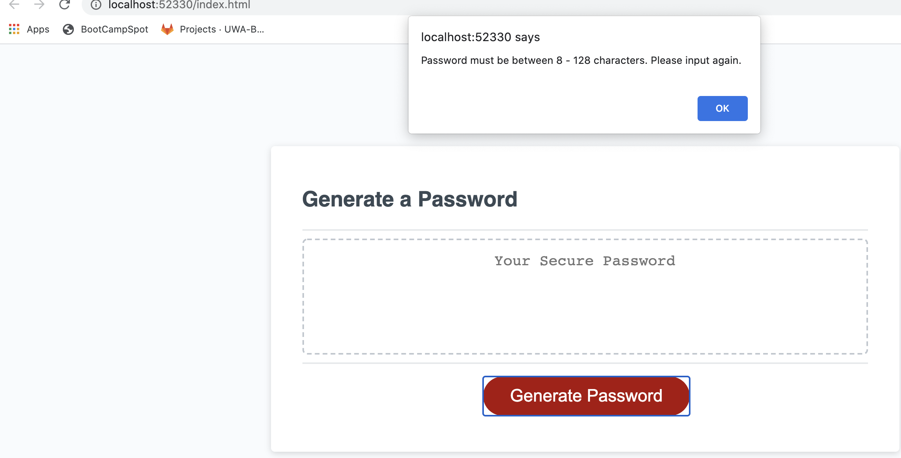

# homework03 
# Password Generator

## Description

* This application builds upon starter code. 

* This program prompts employees to generate a random secure password based on criteria they have selected.

* The password needs to meet the following criteria: a length between 8 - 128 characters, and at least one of the following character types: lowercase, uppercase, numeric and/or special characters. 

* Once all criteria has been met, the new secure password is generated and displayed in the textbox.

* If any of the criteria is not met, an alert pops up e.g. "Character length must be greater than 8."

## Images

## Deployment

## URL of deployed application. 
https://ajovich.github.io/homework03/

## URL of GitHub repository.
https://github.com/ajovich/homework03